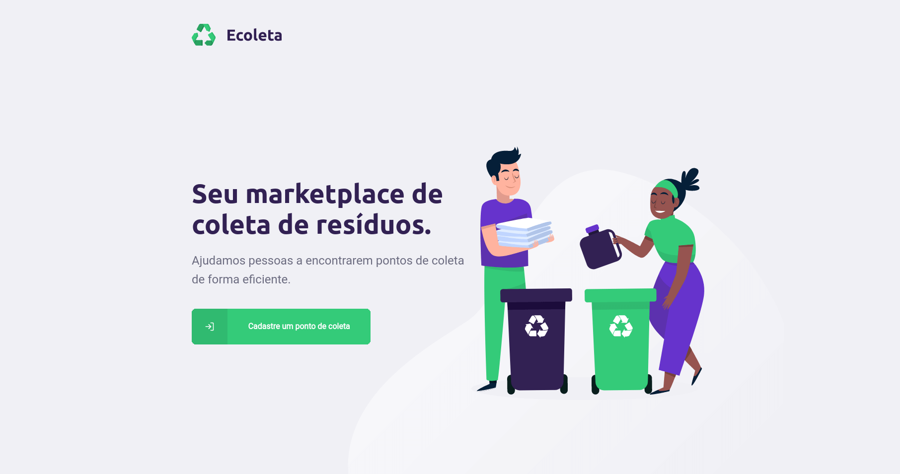
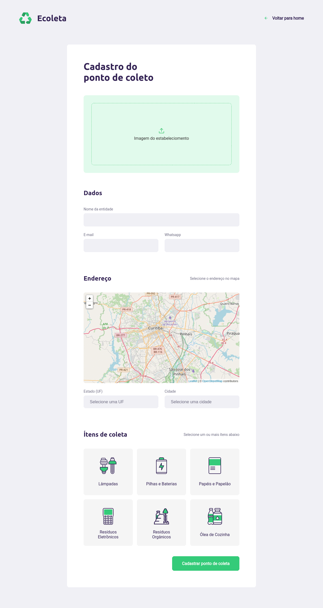
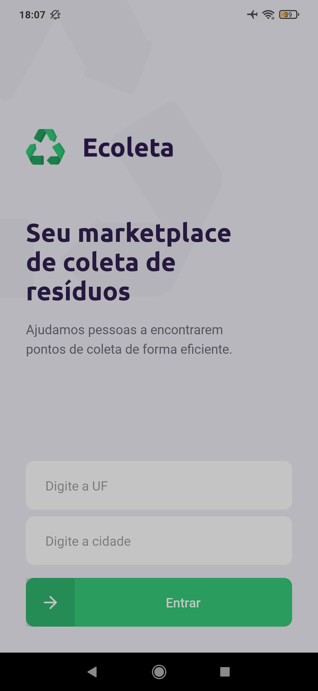
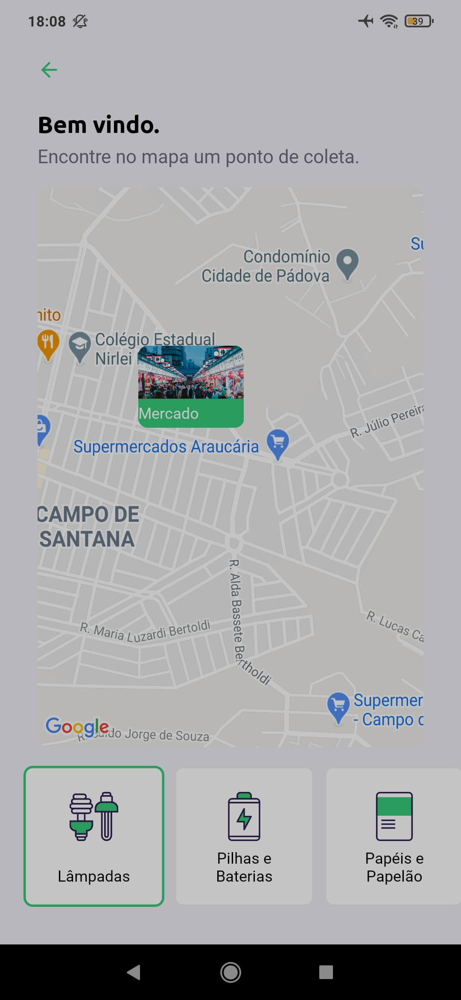
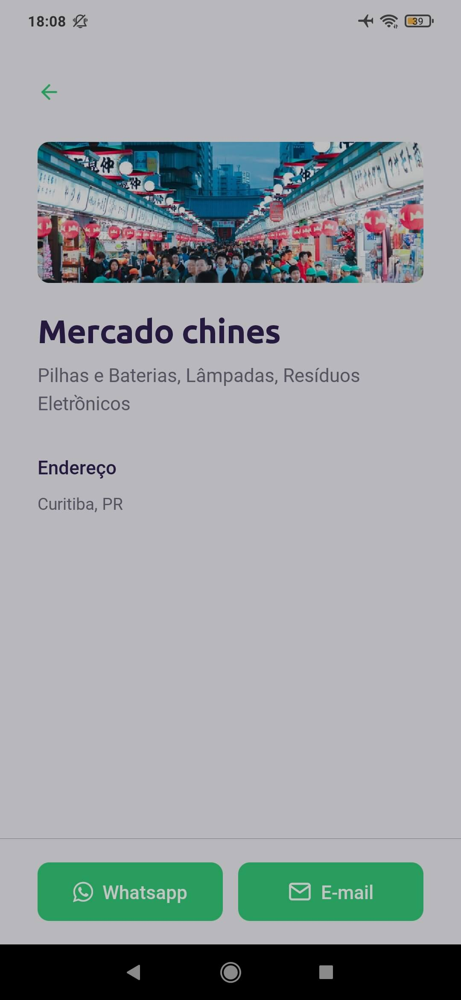

# Rocketseat Next Level Week #1

<h1 align="center">
    
    
</h1>

<h1 align="center">
    
    
    
</h1>

## 💻 Projeto

Projeto desenvolvido no evento "Next Level Week 1" da [Rocketseat](https://rocketseat.com.br/).

O Ecoleta é um marketplace que ajuda pessoas a encontrarem pontos de coleta de resíduos de forma eficiente.

## :rocket: Tecnologias

Esse projeto foi desenvolvido com as seguintes tecnologias:

- [Node.js](https://nodejs.org/en/)
- [TypeScript](https://www.typescriptlang.org/)
- [React](https://pt-br.reactjs.org/)
- [React Native](https://reactnative.dev/)
- [Expo](https://expo.io/)

## 🔨 Como usar

Para clonar essa aplicação, você vai precisar de [Git](https://git-scm.com/), Node.js v12+ e [Npm](https://www.npmjs.com) instalado.

### Iniciar API

```bash
# Diretório da API
cd server

# Instalar dependências
npm install

# Rodar migração para criar as tabelas
npm run knex:migrate

# Rodar "Seed" para popular o banco com os dados necessários
npm run knex:seed

# Iniciar servidor rodando na porta 3333
npm run dev
```

### Iniciar Frontend

```bash
# Diretório do frontend
cd web

# Instalar dependências
npm install

# Iniciar aplicação rodando na porta 3000
npm start
```

### Iniciar Mobile

```bash
# Diretório do mobile
cd mobile

# Instalar dependências
npm install

# Iniciar aplicação no Expo
npm start
```

## 🔖 Layout

Você pode visualizar o layout do projeto através [desse link](https://www.figma.com/file/9TlOcj6l7D05fZhU12xWT3/Ecoleta-Booster?node-id=0%3A1).

## :memo: Licença

Esse projeto está sob a licença MIT. Veja o arquivo [LICENSE](LICENSE.md) para mais detalhes.

---

<sup>Projeto desenvolvido com a tutoria de [Diego Fernandes](https://github.com/diego3g), da [Rocketseat](https://rocketseat.com.br/).</sup>
